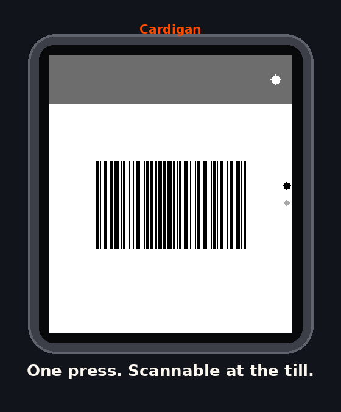
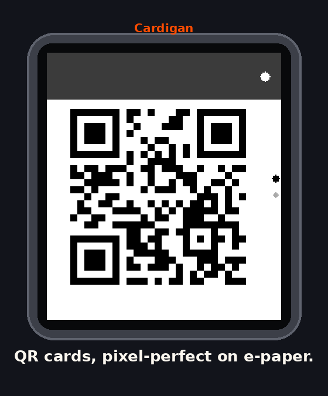
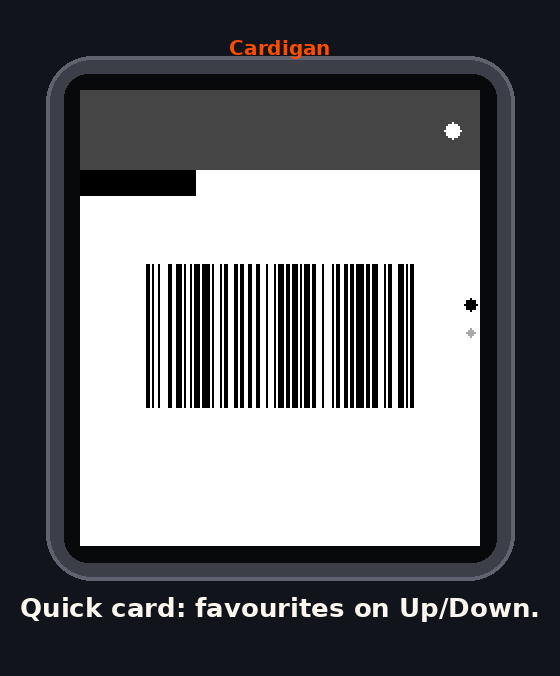
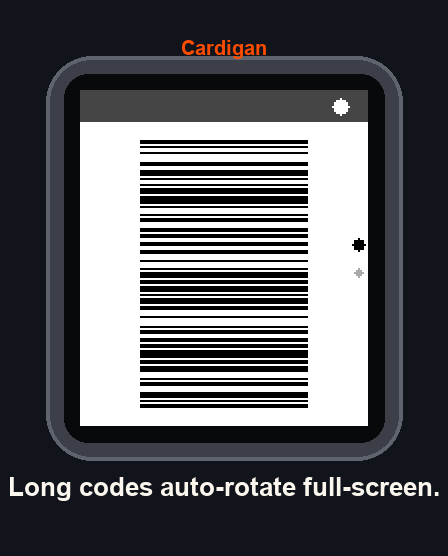

<p align="center">
  
</p>

<p align="center">
  <a href="https://github.com/Seifollahi/cardigan/actions/workflows/test.yml"></a>
  <a href="https://github.com/Seifollahi/cardigan/actions/workflows/build-pbw.yml"></a>
  
  
  
</p>

**Cardigan** is a loyalty-card wallet for Pebble smartwatches. Your cards live
on your wrist as real, scannable **Code 128 barcodes and QR codes** — one
button press from the launcher to the till, no phone in hand, works fully
offline. Runs on all seven platforms: the 2013 original through the
**Pebble Time 2** (emery), **Pebble 2 Duo** (flint) and **Pebble Round 2**
(gabbro), square and round alike.

<p align="center">
  
  
  
  
</p>

## Why it's fast at the till

Open Cardigan and your **last-used card is already on screen**. Up/Down hops
between favourites. That's the whole checkout interaction. Everything else —
balance page, favourite/quick/delete actions, the full card list — is one
press deeper.

Cards are managed from a settings page in the Pebble phone app: add, edit,
reorder, recolour (true Pebble 64-colour palette), choose barcode or QR.
Saving syncs to the watch in about a second over Bluetooth LE.

## Engineering under the constraints

The watch never encodes anything. The phone pre-encodes every card and the
watch just fills rectangles — integer math only, 1-bit black-on-white for
maximum scanner contrast on e-paper.

| Constraint | Decision |
|---|---|
| `persist` values max **256 B**, ~4 KB total | One card = one packed 240 B record (`_Static_assert`ed); 12 cards max. |
| AppMessage one-in-flight, small buffers | One card per message, sequential ACK queue with retry; sync skipped entirely when the card set is unchanged (no flash wear, no spurious vibe). |
| Small heap, no FPU budget | Phone ships Code 128 as run-length bar widths (1 B each) and QR as packed module bits (≤ v3 = 106 B). |
| Narrow displays vs. long codes | Set C + B→C switching halves digit-code width; barcodes auto-rotate 90°, and a full-height "tall mode" drops the chrome when needed. The phone knows the connected watch and falls back to QR when a barcode exceeds that display's budget. A code that still can't fit is never drawn clipped — the number is shown large instead, because a truncated barcode scans as the *wrong* number. |
| Round displays (chalk, gabbro) | Codes are fitted against the circle, not a bounding box: a rectangle fits iff (w/2)² + (h/2)² ≤ r², solved with an integer square root. |
| B&W watches (aplite/diorite/flint) | `PBL_IF_COLOR_ELSE` throughout — same source, seven platforms. |
| Battery | Backlight only pulses while a code is on screen; static frames, minimal redraws. |

## Install

- **Rebble store**: search "Cardigan" (Tools).
- **Sideload**: grab `cardigan.pbw` from [Releases](../../releases) and open it
  with the Pebble app, or `pebble install --phone <ip>`.

## Working on it

Everything runs through `make` — `make` on its own lists the targets.

```sh
make deps        # one-time: scanner libraries for the test suite
make test        # the whole host suite — no Pebble SDK needed
make run         # build + launch the Pebble Time 2 emulator (needs SDK)
make install PHONE=192.168.1.42     # sideload to a paired watch
make release V=1.1.0                # test, build, tag, publish
```

Building the watchapp needs the [Pebble SDK](https://developer.rebble.io/sdk/)
and the ARM toolchain (`brew install arm-none-eabi-gcc`); `build_mac.sh`
installs both from scratch on a clean Mac.

## Testing without a watch — or an SDK

`make test` runs the entire pipeline on any machine with gcc, node and
python:

| Stage | What it proves |
|---|---|
| `make unit` | Code 128 output decodes back to the original text with a valid checksum; QR packs into the watch's bit layout losslessly; payloads fit the C struct limits |
| `make lint` | every JS file parses; the C compiles clean under `-Wall -Wextra -Werror` in colour, B&W **and** round configurations |
| `make render` | the real `card_window.c` draws into a framebuffer at 200×228, 144×168, 180×180 and 260×260, while the real `storage.c`/`comm.c` handle a real captured AppMessage stream |
| `make scan` | **zxing-cpp decodes those rendered frames** — if a scanner couldn't read the screen, the build fails |

Current status: **20 unit assertions**, **15/15 app-logic checks** (sync
protocol, favourites carousel, action menu, reboot persistence,
interrupted-sync self-heal) and **24/24 scanner decodes** across all four
display geometries. CI runs this on every push and attaches the rendered
frames to the run, so any UI change is reviewable as pixels.

`docs/screenshots/all_platforms.png` shows the rasterizer's real output.

## Releasing

Push a version tag and CI does the rest — it installs the SDK, builds the
`.pbw` for all seven platforms, verifies every one made it into the bundle,
and attaches the binary to the GitHub release:

```sh
make release V=1.1.0    # bumps, tests, builds locally, tags and publishes
```

Or tag by hand and let CI produce the binary:

```sh
git tag v1.1.0 && git push origin v1.1.0
```

Every push also uploads a `cardigan-pbw` artifact, so any commit can be
sideloaded without building anything locally.

## Architecture

```
src/c/          watchapp: storage (persist), comm (AppMessage), menu + card windows
src/pkjs/       phone: Code 128 & QR encoders, sync queue, data-URI settings page
test/           behavioural SDK stub, functional harness, unit + scanner tests
docs/           architecture notes, brand assets, store listing copy
```

```
   phone (PebbleKit JS)                        watch (C)
   ─────────────────────                       ──────────
   card store (localStorage)
        │  encode Code 128 → bar widths
        │  encode QR       → packed bits
        ▼
   sync queue ──── AppMessage ────▶  comm.c ──▶ storage.c (persist, 240 B/card)
   one card per message,                              │
   ACK + retry, skipped when                          ▼
   nothing changed                          card_window.c — integer-only
                                            rasterizer, fits codes to the
                                            display (round or square)
```

[`docs/ARCHITECTURE.md`](docs/ARCHITECTURE.md) explains the design decisions;
the wire protocol and message keys live in [`src/c/wallet.h`](src/c/wallet.h).

## Contributing

Issues and PRs welcome — see [CONTRIBUTING.md](CONTRIBUTING.md) and the
[code of conduct](CODE_OF_CONDUCT.md). `make test` runs on any machine with
gcc, node and python; you need neither the SDK nor a watch to work on most
of the app. Privacy and reporting details are in [SECURITY.md](SECURITY.md).

## License

MIT © Mo Seifollahi. Bundles [qrcode-generator](https://github.com/kazuhikoarase/qrcode-generator)
(MIT, © Kazuhiko Arase). "QR Code" is a registered trademark of DENSO WAVE.
Not affiliated with Core Devices or the Rebble Foundation — Pebble is their
trademark and their delightful hardware.
