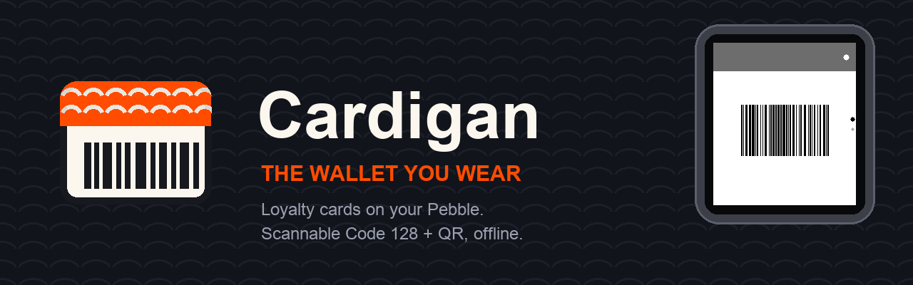

  

# Brand

Everything here is generated by [`docs/make_assets.py`](../make_assets.py) —
run `make assets`. Don't hand-edit the PNGs; change the script so the brand
can't drift between the README, the store listing and the app icon.

## The name

**Cardigan.** Cards you wear. The knit collar on the mark is the joke, and
it's why the tagline works:

> **The wallet you wear.**

Lowercase "cardigan" in code and filenames; capitalised in prose. Never
"Pebble Wallet" — that was the working title and it leans on someone else's
trademark.

## Palette

| Colour | Hex | Used for |
|---|---|---|
| Yarn Orange | `#FF4C00` | the collar, the tagline, one accent per surface |
| Charcoal | `#17191F` | the card outline and barcode bars |
| Cream | `#FBF7EF` | the card face |
| Ink | `#12141B` | backdrops behind marketing art |
| Muted | `#9BA0AF` | secondary text |

Orange earns its loudness by being rare — collar, tagline, one accent.
Everything else is charcoal on cream.

**On the watch this palette does not apply.** Card colours come from the
user's own choices, constrained to Pebble's 64-colour RGB-222 palette, and
codes are always pure black on pure white for scanner contrast. Brand
styling stops at the bezel.

## The mark

A loyalty card wearing a knit collar. Two variants, and the difference
matters:

- **`full`** — two rows of knit scallops, eleven barcode bars. Use at
  64px and above.
- **`simple`** — no scallops, six thicker bars. Use below 64px, where the
  fine detail turns to mush.

`mark.png` is the standalone artwork; `logo.svg` is the mark plus wordmark
for anywhere that can take vector.

## The launcher icon is a special case

`resources/images/menu_icon.png` is **not** a small version of the mark.
Pebble reduces menu icons to 1 bit: opaque pixels are drawn in the
launcher's foreground colour, transparent ones disappear. A full-colour
picture becomes a white blob.

So the icon is a silhouette — a solid card with the collar line and barcode
bars *knocked out* of it. It reads correctly on the dark launcher, and the
knocked-out bars survive at 25px where drawn bars would not.

## Files

| File | Size | Where it's used |
|---|---|---|
| `mark.png` | 320×320 | standalone artwork, social avatars |
| `logo.svg` | vector | anywhere that takes SVG |
| `banner.png` | 1280×400 | README hero |
| `../store/assets/banner_720x320.png` | 720×320 | Rebble store banner (required) |
| `../store/assets/icon_large_144.png` | 144×144 | store app-locker icon |
| `../store/assets/icon_small_48.png` | 48×48 | store app-locker icon, small |
| `../../resources/images/menu_icon.png` | 25×25 | on-watch launcher |
| `../screenshots/framed_*.png` | varies | GitHub and social, not the store |
| `../screenshots/all_platforms.png` | varies | every display geometry at once |

## Marketing images use real pixels

The watch screens inside the banners and framed shots are **actual frames
rendered by the app's own rasterizer** during `make test`, not mock-ups. If
`test/out/` is empty when you run `make assets`, the script says so and
leaves the watch blank rather than inventing something.

Store screenshots are different again: those must be genuine native-resolution
captures from the emulator (`make screens`), never the framed marketing art.

## Attribution

Cardigan is not affiliated with Core Devices or the Rebble Foundation.
"Pebble" is their trademark. "QR Code" is a registered trademark of
DENSO WAVE INCORPORATED.
